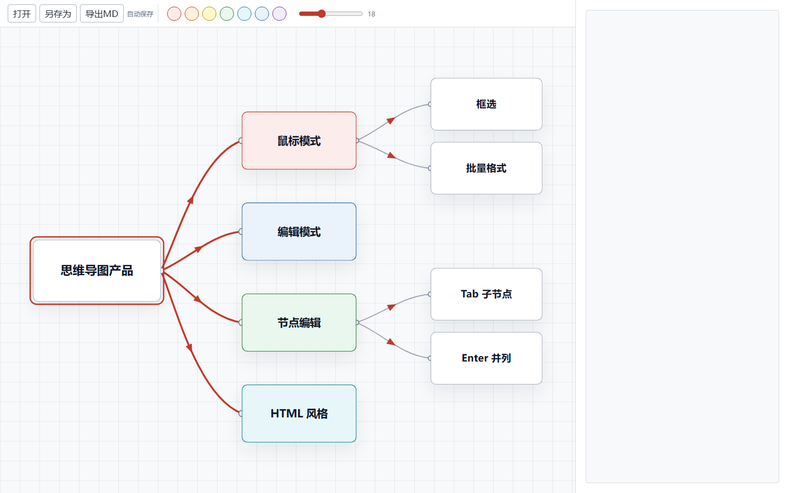
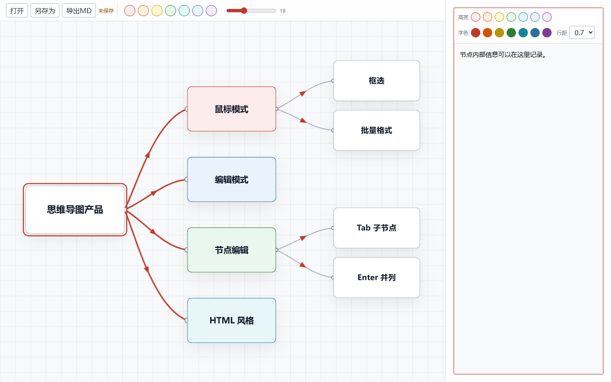
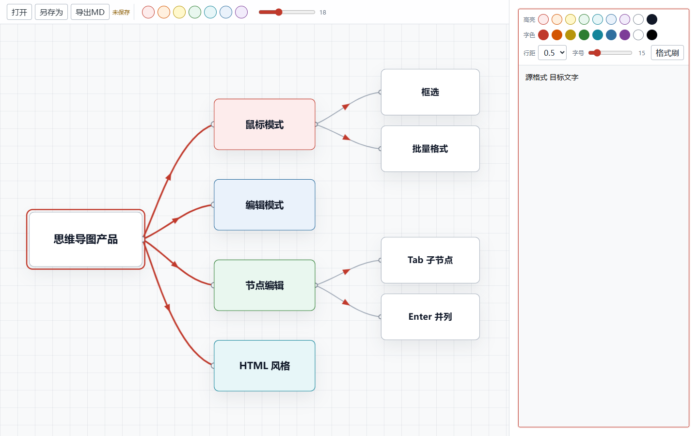
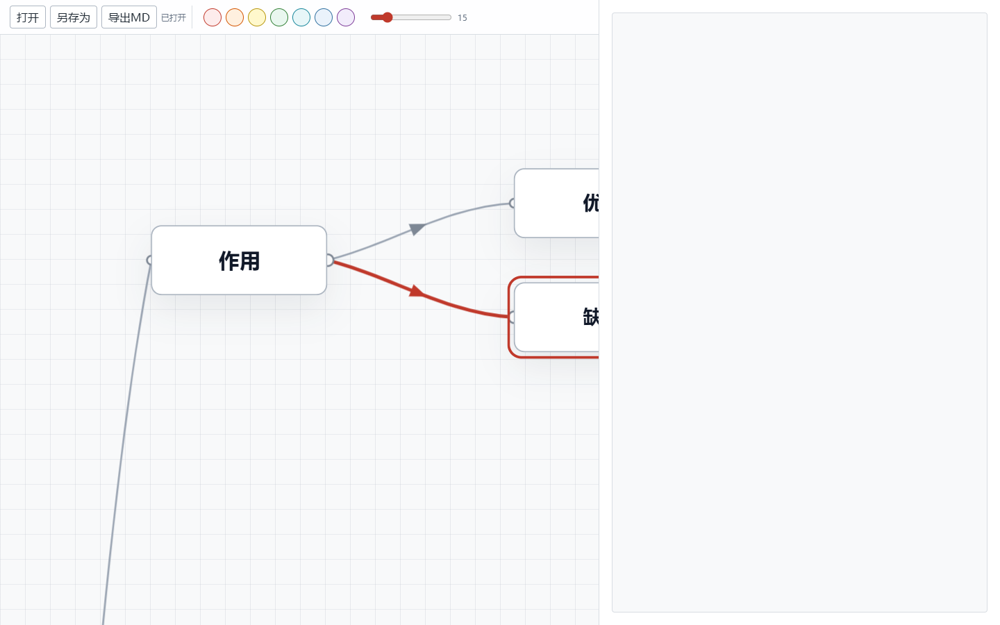

# Smind

Smind 是一款本地优先的思维导图产品，面向需要快速整理多节点、多层级内容的个人工作流。它使用浏览器技术实现，但不依赖服务器部署；项目数据独立存储为本地 `.mindmap.json` 文件，适合持续迭代、自动保存和离线使用。



## 核心定位

Smind 不是普通画图工具，而是一个以“节点结构 + 富文本内容”为中心的思维导图工作台：

- 画布上管理节点、层级、连接关系和整体布局。
- 右侧栏管理节点内部信息，可编辑富文本。
- 数据文件与程序分离，方便保存、备份、迁移和导入。
- 面向大图场景做了缓存和视口裁剪，减少拖动、缩放时的卡顿。

## 主要能力

- 节点创建、删除、复制、剪切、粘贴和撤销。
- 子节点、并列节点、独立节点和概要节点。
- 鼠标拖动节点、框选多节点、批量移动和批量设置节点颜色/字号。
- 方向键在父子节点、同级节点之间导航，并自动把当前节点居中到视图。
- `Ctrl+Q` 整理选区，按层级重新居中排布。
- 画布滚轮缩放，缩放中心跟随鼠标。
- 自动保存、手动保存、另存为和 Markdown 导出。

## 右侧富文本编辑器

单击任意节点后，右侧栏会显示该节点的内部内容。编辑器支持高亮、字色、字号、行距和格式刷，并会清洗外部富文本，避免复杂嵌套样式和 Smind 自身格式规则冲突。



支持的富文本能力：

- 高亮颜色：红、橙、黄、绿、青、蓝、紫、白、黑。
- 字体颜色：红、橙、黄、绿、青、蓝、紫、白、黑。
- 选中文字后调整字号。
- 调整节点内容整体行距。
- 格式刷：复制一段文字的高亮、字色和字号，并刷到另一段文字。
- 编辑器内独立 `Ctrl+Z` 撤销。



## 大图性能

Smind 对大规模节点做了几项基础优化：

- 拖动画布、缩放画布时只更新 viewport transform。
- 节点 DOM 和 SVG 连线会缓存复用。
- 拖动节点时只更新相关节点和相关连线。
- 视口外节点和连线会被隐藏，减少无效绘制。



## 数据与文件

Smind 的项目数据放在 `data/` 目录中，文件格式为 `.mindmap.json`。程序源码、测试文件和数据文件相互独立，方便后续继续扩展多种导入/导出格式。

常用数据文件示例：

- `data/default.mindmap.json`
- `data/mysql.mindmap.json`
- `data/Redis.mindmap.json`
- `data/Golang.mindmap.json`

## 快捷键

- `Tab`：创建子节点。
- `Enter`：创建并列节点；如果正在编辑节点表面文字，则第一次 `Enter` 只结束编辑。
- `Delete` / `Backspace`：删除当前节点及其子节点。
- `Ctrl+A`：选择全部节点。
- `Ctrl+C` / `Ctrl+X` / `Ctrl+V`：复制、剪切、粘贴节点。
- `Ctrl+Z`：撤销；右侧编辑器内优先撤销文本/富文本编辑。
- `Ctrl+S`：保存。
- `Ctrl+Q`：整理选区。
- `Ctrl+B`：为同层同父的多个节点创建概要节点。
- `Ctrl+Space`：连接节点。
- `Ctrl+Alt`：在鼠标位置创建独立节点。
- 方向键：在父节点、子节点和同级节点间切换。

## 本地运行

直接打开：

```text
D:\Smind\src\index.html
```

如果要运行自动化测试：

```bash
cd /d D:\Smind
npm run test:richtext
npm run test:storage
npm run test:keyboard
npm run test:performance
node src\logic.test.js
```

## 当前状态

Smind 目前是本地个人工具的早期产品版本。核心画布、节点编辑、右侧富文本、自动保存、文件打开、格式刷、快捷键和大图基础性能已经具备，后续可以继续扩展为更完整的桌面应用或本地文件型知识整理工具。
